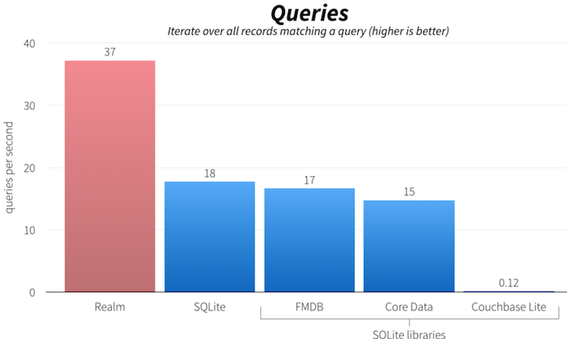

s 오픈 소스 데이터베이스 관리시스템(DBMS). NoSQL 데이터베이스를 지향하며, 데이터 모델 구조 자체가 객체 컨테이너로 구성되어 있다.

-	Realm과 타 데이터베이스의 초당 쿼리수 비교 <br>

제한
----

-	클래스 이름은 최대 57자
-	필드 이름은 최대 63자
-	모델 클래스는 RealmObject 이외의 클래스 상속 불가능<br>

Gradle
------

```kotlin
dependencies {
   classpath "io.realm:realm-gradle-plugin:6.0.2"
}
```

build.gradle(Project)

```kotlin
apply plugin: 'kotlin-kapt'
apply plugin: 'realm-android'
```

build.gradle(app)<br>

Model Class
-----------

```kotlin
open class UserModel : RealmObject() {
    @PrimaryKey var index:Int = 0
    var name: String = ""
}
```

-	모델 클래스는 SQL의 테이블을 생각하면 될 것 같다. Table : UserModel Column : index, name<br>

시작(선언)
----------

```kotlin
Realm.init(context)
```

어플리케이션이 실행되는 시점 또는 Realm을 사용하는 공통된 부분의 처음 시점에서 선언.<br>

설정
----

```kotlin
val configuration = RealmConfiguration.Builder()
    .name(fileName) // fileName ex > default.realm
    .schemaVersion(0)
    .deleteRealmIfMigrationNeeded()
    .modules(Model::class.java)
    .encryptionKey(key)
    .inMemory()
    .build()
val realm = Realm.getInstance(configuration)
```

-	Realm Instance 는 Thread Singleton 이므로 매 Thread 마다 정적 생성자가 동일한 Instance 를 반환한다
-	name : Context.filesDir 에 위치한 test.realm 파일 ( 절대경로 : realm.path )
-	schemaVersion : 데이터 모듈이 수정되면 어떻게 변경되었는지 알려줘야하는데(Migration) schemaVersion 으로 관리. 추후에 상세하게 다룬다
-	deleteRealmIfMigrationNeeded : Migration 무시. 주로 개발할 때 사용한다.
-	modules : 사용할 모듈(데이터 모델). 꼭 필요하지는 않는듯 하다
-	encryptionKey : 64Byte 암호화 키 처음 32Byte 는 암호화에 사용되고 다음 24Byte 는 서명에 사용되고 8Byte 는 현재 사용 X. 각 4KB 데이터 블록은 암호화 블록체인(CBC) 모드와 파일 내에서 절대 재사용되지 않는 고유한 초기화 백터(IV)를 사용하여 AES-256으로 암호화 된 후 SHA 로 서명.
-	inMemory : 디스크에 저장하지 않고 메모리에 생성되고 Realm 이 닫히면 삭제된다.<br>

READ
----

```kotlin
realm.beginTransaction()
val realmResult:RealmResults<UserModel> =
    realm.where(UserModel::class.java).findAll().sort("index", Sort.ASCENDING)
val singleUser: UserModel =
    realm.where(UserModel::class.java).equalTo("index", position).findFirst()
realm.commitTransaction()
```

-	데이터를 Select할 때 where절을 이용한다.
-	전체 데이터를 찾으려면 findAll()
-	하나의 데이터만 찾으려면 findFirst()
-	sort, equalTo 첫번째 파라미터는 필드명, 두번째 파라미터는 value<br>

INSERT
------

```kotlin
realm.beginTransaction()
val index = realm.where(UserModel::class.java).max("index")
val nextIndex = if(index == null){
  1
}else{
  index.toInt() + 1
}
val user:UserModel = realm.createObject(UserModel::class.java, nextIndex)
user.name = "이름"
realm.commitTransaction()
```

-	Realm에서는 auth_increment가 없어 PrimaryKey를 증가시키려면 수동으로 해줘야 한다.
-	PrimaryKey가 없는 경우에는 nextIndex를 빼주면 된다. realm.createObject(UserModel::class.java)<br>

UPDATE
------

```kotlin
realm.beginTransaction()
val user: UserModel =
    realm.where(UserModel::class.java).equalTo("index", position).findFirst()
user.필드명 = 수정할 값 // user.name = "수정"
realm.commitTransaction()
```

<br>

DELETE
------

```kotlin
realm.beginTransaction()
val user: UserModel =
    realm.where(UserModel::class.java).equalTo("index", position).findFirst()
user.필드명 = 수정할 값 // user.name = "수정"
realm.commitTransaction()
```

<br>
